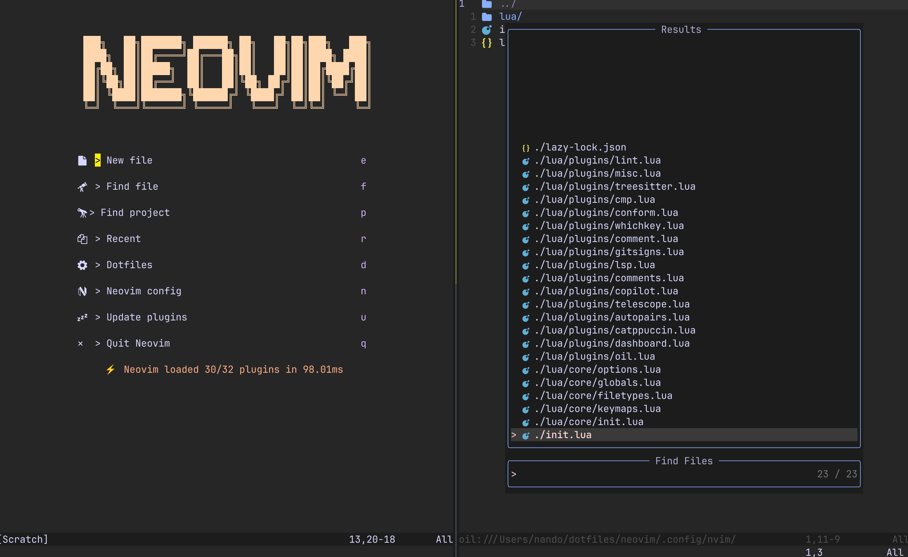

# dotfiles

My personal macOS configuration, managed with [GNU Stow](https://www.gnu.org/software/stow/). Uses [WezTerm](https://wezterm.org) as both terminal emulator and multiplexer.




## Configurations

| Package | Description |
|---------|-------------|
| `neovim` | Neovim editor config |
| `fastfetch` | System info display |
| `starship` | Shell prompt |
| `tmux` | Terminal multiplexer |
| `wezterm` | Terminal emulator |
| `zshrc` | Zsh shell config |
| `homebrew` | Homebrew packages |

## Setup

### Prerequisites

- [Homebrew](https://brew.sh)
- [GNU Stow](https://www.gnu.org/software/stow/) — `brew install stow`

### Install

Clone the repo and stow whichever configs you want:

```zsh
git clone https://github.com/NandovdK/dotfiles.git ~/dotfiles
cd ~/dotfiles

stow neovim
stow fastfetch
stow starship
stow tmux
stow zshrc
stow wezterm
stow homebrew


brew bundle dump --file ${HOME}/Brewfile --force
```
